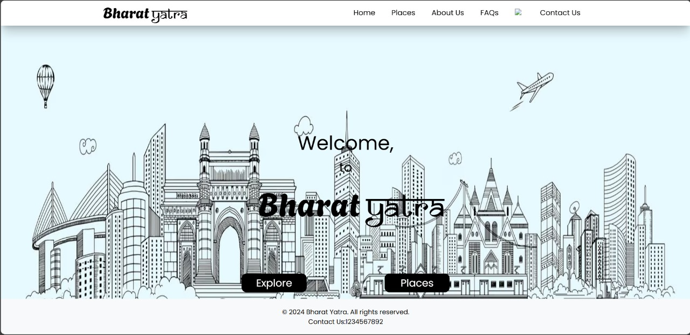

# Bharat Yatra

Bharat Yatra is a comprehensive tourism website that helps travelers explore India's rich diversity. It suggests travel destinations based on **categories** such as historical sites, beaches, and natural wonders, and also provides information on **specific places** like Chennai, Mysore, Goa, Shimla, and more. The website highlights the **best times** to visit each location, **notable festivals** celebrated there, and **popular activities** to enjoy. Additionally, it suggests **nearby attractions** for a well-rounded travel experience. Bharat Yatra also offers **valuable travel tips** to ensure a safe and enjoyable journey. Discover the beauty and cultural heritage of India with Bharat Yatra.




## Demo
Link to the live demo: [Tourism Peach](https://tourism-peach.vercel.app/)

## Technologies
 This project is built with the following technologies: 
 - HTML
 - CSS3 
 - JavaScript 
 - React 
 -  Any backend technologies (e.g., Node.js, Python) (yahan pe jo likhna hai wo baad me dekhungi)
 
## Getting Started 
These instructions will get you a copy of the project up and running on your local machine for development and testing purposes.
When setting up a React website, the prerequisites typically involve having the right environment on your machine, which includes several software tools and technologies. Here is a list you can include in the "Prerequisites" section of a README file for a React project:


## Prerequisites

Before you begin, ensure you have met the following requirements:

- **Node.js**: React projects are built using Node.js. It is essential for npm (Node Package Manager), which you will use to manage your project's dependencies. Install Node.js from [Node.js official website](https://nodejs.org/). The LTS (Long Term Support) version is recommended.

  ```bash
  # Verify Node.js installation
  node --version
  ```

- **npm (Node Package Manager)**: npm is included with Node.js installation. npm is used to install dependencies, run scripts, and manage packages in your project.

  ```bash
  # Verify npm installation
  npm --version
  ```

- **Git**: Version control is crucial for managing changes to the project, collaborating with others, and deploying code. Download and install Git from [Git's official site](https://git-scm.com/).

  ```bash
  # Verify Git installation
  git --version
  ```

- **A code editor**: While any text editor works for writing code, using an IDE or a code editor like Visual Studio Code, Sublime Text, or Atom can enhance your coding experience with features like syntax highlighting, auto-completion, and debugging tools.

  - [Visual Studio Code](https://code.visualstudio.com/download)
  - [Sublime Text](https://www.sublimetext.com/3)
  - [Atom](https://atom.io/)


## Installation

1.  **Create a folder** : Make a folder on your local machine. Open that folder on code-editor.
2.  **Clone the repository** : Use Git to clone the project repository to your local machine:
    https://github.com/Omkar-Sonawane-23/Tourism.git
    
3.  **Install dependencies**
    Navigate to the project directory and install the required dependencies:
    `npm install` 
    
4.  **Run the application**       
    Provide the command to start the development server:
    `npm run dev` 
    
    This should start the server on `localhost` with a default port, typically 5173. You can access the application by navigating to `http://localhost:5173/` in your web browser.

## Contributing

1.  Fork the project to your GitHub account.

2. Open your terminal or command prompt window.
		- <u>On Mac</u>:     Cmd + J
		- <u>On Windows</u>:     Ctrl + J
		- 
3. Fetch Latest Changes (Optional but Recommended) 	
		 `git fetch`

4. Create an issue or request to work on an existing issue.

5.  Create your Feature Branch 
 `git checkout -b {branch name}`
 
6. Add your changes 
 	`git add {filename}`
 	
7. Commit your Changes 
 `git commit -m {change message}`
 
8.  Push to the Branch 
 `git push --set-upstream origin {branch name}`
 
9.  Open a Pull Request
